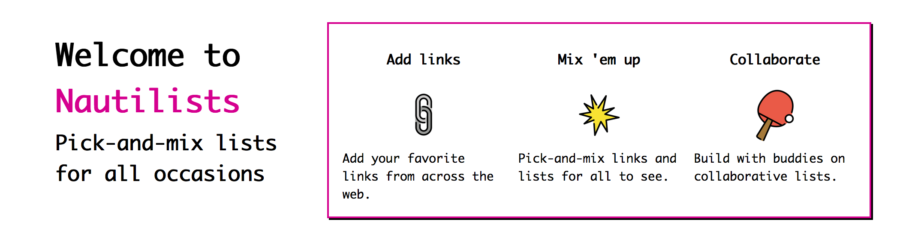

# www.nautilists.com

> Pick and mix lists for all occasions



## About 
> Welcome to Nautilists: Pick-and-mix lists for all occasions

### Add links
> Add your favorite links from across the web.

### Mix 'em up
> Pick-and-mix links and lists for all to see.


### Collaborate
> Build with buddies on collaborative lists.


## Features (forthcoming!)

- Allow for posting and remixing public lists served from nautilist-server

## Setup

### Backend

* Download and install the dependencies for [nautilist public](https://github.com/nautilist/nautilist-public)
* Run the application - make sure you're running mongodb in the background

### Frontend

* Download and install the dependencies for [nautilist editor](https://github.com/nautilist/nautilist-editor)
* Run the application - make sure you're running mongodb in the background and you have the server running

### Important credentials
If you're developing, you'll need a gmail to handle login confirmation and password reset. Only team members will have access to those infos, but you can test/develop with your own email credentials :) 


## Run

Install the dependencies

```sh
npm install
npm start
```

### Choo Commands
Command                | Description                                      |
-----------------------|--------------------------------------------------|
`$ npm start`          | Start the development server
`$ npm test`           | Lint, validate deps & run tests
`$ npm run build`      | Compile all files into `dist/`
`$ npm run create`     | Generate a scaffold file
`$ npm run inspect`    | Inspect the bundle's dependencies

### Build and deployment Commands

Command                   | Description                                      |
--------------------------|--------------------------------------------------|
`$ npm run quick-deploy`  | build and deploy to heroku


## CODE OF CONDUCT

See [CODEOFCONDUCT.md](CODEOFCONDUCT.md)

## CONTRIBUTING

Interested in contributing see: [CONTRIBUTING](CONTRIBUTING.md)

## Process

My design and development process is logged here - link coming soon.

***
***
## Notes
***
***
## Heroku Deployment notes

Using the Heroku static page buildpack: https://github.com/heroku/heroku-buildpack-static

Add it to your project
```
heroku buildpacks:set https://github.com/heroku/heroku-buildpack-static.git -a nautilist-editor
```

Set heroku remote
```
https://devcenter.heroku.com/articles/git#for-an-existing-heroku-app
```

Build it!
```
git push heroku master
```

clear your cache:
https://devcenter.heroku.com/articles/git#build-cache 
https://github.com/heroku/heroku-repo#purge-cache
```
$ heroku repo:purge_cache -a nautilist-editor
```
